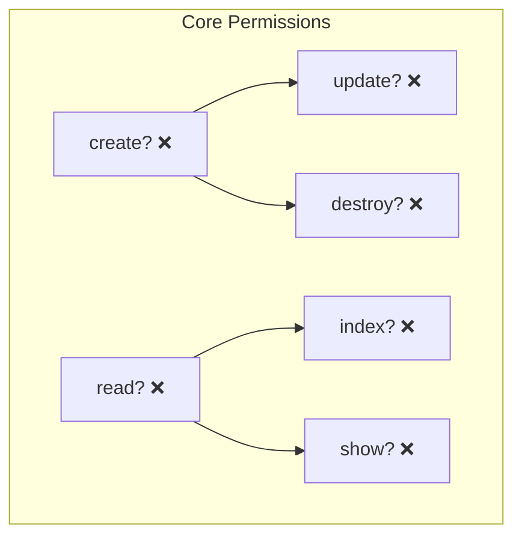
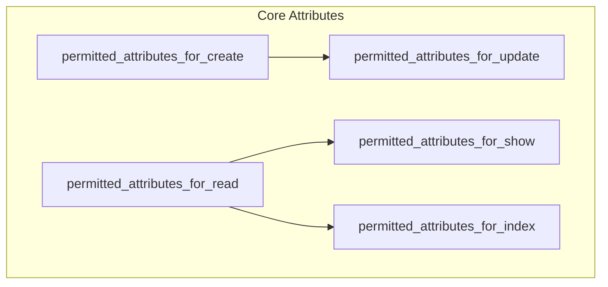

# Authorization and Access Control

Plutonium provides a robust authorization system built on top of [Action Policy](https://actionpolicy.evilmartians.io/), offering fine-grained access control, resource scoping, and entity-based authorization.

## Overview

Authorization in Plutonium operates at multiple levels:
- Resource-level policies
- Action-based permissions
- Entity-based scoping
- Attribute-level access control

## Basic Policy Definition

Every resource in Plutonium requires a policy. Here's a basic example:

```ruby
class BlogPolicy < ResourcePolicy
  # Core CRUD Permissions

  def create?
    # All authenticated users can create blogs
    true
  end

  def read?
    # Allow anyone to read blogs
    true
  end

  def update?
    # Allow only the blog owner to update
    owner?
  end

  def destroy?
    # Allow only the blog owner or admins to destroy
    owner? || user.admin?
  end

  # Attribute Control

  def permitted_attributes_for_create
    [:title, :content, :category]
  end

  def permitted_attributes_for_read
    [:title, :content, :category, :created_at, :updated_at, :user_id]
  end

  def permitted_attributes_for_update
    [:title, :content, :category]
  end

  # Association Access

  def permitted_associations
    [:comments]
  end

  private

  def owner?
    record.user_id == user.id
  end
end
```

## Default Behaviors in Plutonium Policies

::: info Overview
Plutonium's Policy system implements a secure-by-default pattern with clear inheritance chains for both permissions and attribute access.
:::

### Permission Defaults

Permission methods follow two key patterns: core permissions that default to `false`, and derived permissions that inherit from core ones.

#### Core Permission Chain



::: warning Security First
All core permissions (`create?` and `read?`) default to `false`. You must explicitly override these to grant access.
```ruby
# Default implementations
def create?
  false
end

def read?
  false
end
```
:::

#### Permission Inheritance

::: code-group
```ruby [Action Methods]
def update?
  create?    # Inherits from create?
end

def destroy?
  create?    # Inherits from create?
end

def index?
  read?      # Inherits from read?
end

def show?
  read?      # Inherits from read?
end
```

```ruby [Helper Methods]
def new?
  create?    # Matches create?
end

def edit?
  update?    # Matches update?
end

def search?
  index?     # Matches index?
end
```
:::

### Attribute Permission Defaults

Attribute permissions also follow an inheritance pattern, but with auto-detection in development:

::: details Inheritance Chain

:::

#### Core Implementation Details

::: code-group
```ruby [Create Attributes]
def permitted_attributes_for_create
  # Auto-detects fields but excludes system columns
  autodetect_permitted_fields(:permitted_attributes_for_create) - [
    resource_class.primary_key.to_sym,
    :created_at,
    :updated_at
  ]
end
```

```ruby [Read Attributes]
def permitted_attributes_for_read
  # Auto-detects all fields
  autodetect_permitted_fields(:permitted_attributes_for_read)
end
```

```ruby [Update Attributes]
def permitted_attributes_for_update
  # Inherits from create
  permitted_attributes_for_create
end
```
:::

::: danger Auto-detection Warning
The default attribute detection:
- Only works in development
- Raises errors in other environments
- Shows warning messages
- Must be overridden in production
:::

### Association Defaults

By default, no associations are permitted:

```ruby
def permitted_associations
  []  # Must be explicitly defined
end
```

### Context Object Defaults

Two built-in authorization contexts:

::: code-group
```ruby [Required Context]
# User must be present
authorize :user, allow_nil: false
```

```ruby [Optional Context]
# Entity scope is optional
authorize :entity_scope, allow_nil: true
```
:::

#### Default Scoping Behavior

When an entity scope exists, records are automatically filtered:

```ruby
relation_scope do |relation|
  next relation unless entity_scope
  relation.associated_with(entity_scope)
end
```

#### Adding Custom Contexts

You can add additional authorization contexts:

::: code-group
```ruby [Policy]
class BlogPolicy < ResourcePolicy
  authorize :ability, allow_nil: true

  def promote?
    user.admin? && ability&.can?(:promote, record)
  end
end
```

```ruby [Controller]
class BlogsController < ResourceController
  authorize :ability, through: :current_ability

  private

  def current_ability
    @current_ability ||= Ability.new(current_user)
  end
end
```
:::

## Quick Reference

| Method Type | Default | Inherits From |
|------------|---------|---------------|
| create? | false | - |
| read? | false | - |
| update? | false | create? |
| destroy? | false | create? |
| index? | false | read? |
| show? | false | read? |
| attributes_for_create | auto* | - |
| attributes_for_read | auto* | - |
| attributes_for_update | auto* | create |
| associations | [] | - |

::: warning
\*Auto-detection only works in development
:::

## Security Best Practices

### 1. Never Skip Authorization

Plutonium controllers automatically verify authorization:

```ruby
class BlogsController < ResourceController
  def show
    # This will raise an error if you forget to authorize
    # authorize! resource_record
    render :show
  end
end
```

## Related Resources

- [Action Policy Documentation](https://actionpolicy.evilmartians.io/)
- [Rails Security Guide](https://guides.rubyonrails.org/security.html)
