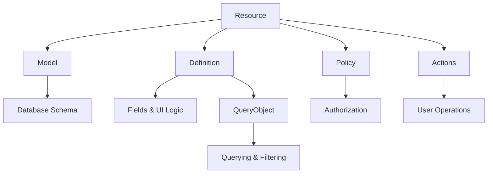

# Core Concepts

::: tip What you'll learn
- Understanding Plutonium's architecture and core abstractions
- How resources and packages work together
- How to organize your application effectively
- Best practices for building maintainable applications
:::

## Resources

Resources are the fundamental building blocks of a Plutonium application. They represent your business domain objects and their associated behavior.

### Anatomy of a Resource

A resource consists of several interconnected components:



::: details Complete Resource Example

::: code-group
```ruby [Model]
# app/models/user.rb
class User < ApplicationRecord
  include Plutonium::Resource::Record

  # Associations
  has_many :posts
  has_many :comments
  belongs_to :organization

  # Scopes
  scope :active, -> { where(status: :active) }

  # Validations
  validates :name, presence: true
  validates :email, presence: true, uniqueness: true
  validates :role, presence: true, inclusion: {in: %w[admin user]}

  def admin? = role == "admin"
end
```

```ruby [Definition]
# app/definitions/user_definition.rb
class UserDefinition < Plutonium::Resource::Definition
  # Display configuration
  field :name, as: :string
  field :email, as: :email

  # Search configuration
  search do |scope, query|
    scope.where("name LIKE :q OR email LIKE :q", q: "%#{query}%")
  end

  # Filters
  filter :role, with: SelectFilter, choices: %w[admin user guest]
  filter :status, with: SelectFilter, choices: %w[active inactive]

  # Scopes
  scope :active

  scope :admins do
    where(role: :admin)
  end

  # Actions
  action :deactivate,
    interaction: DeactivateUser,
    color: :warning,
    icon: Phlex::TablerIcons::UserOff

  # UI Customization
  show_page_title "User Details"
  show_page_description "View and manage user information"
end
```

```ruby [Policy]
# app/policies/user_policy.rb
class UserPolicy < Plutonium::Resource::Policy
  # Basic permissions
  def read?
    true
  end

  def create?
    user.admin?
  end

  def update?
    user.admin? || record.id == user.id
  end

  def destroy?
    user.admin? && record.id != user.id
  end

  # Action permissions
  def deactivate?
    user.admin? && record.status == :active && record.id != user.id
  end

  # Attribute permissions
  def permitted_attributes_for_read
    if user.admin?
      %i[name email role status created_at updated_at]
    else
      %i[name email status]
    end
  end

  def permitted_attributes_for_create
    if user.admin?
      %i[name email role status password]
    else
      %i[name email password]
    end
  end

  def permitted_attributes_for_update
    if user.admin?
      %i[name email role]
    else
      %i[name email]
    end
  end

  # Association permissions
  def permitted_associations
    %i[posts comments]
  end
end
```


```ruby [Deactivate Interaction]
# app/interactions/user_interactions/deactivate.rb
module UserInteractions
  class Deactivate < Plutonium::Resource::Interaction
    # Define presentable metadata
    presents label: "Deactivate User",
             icon: Phlex::TablerIcons::UserOff,
             description: "Deactivate user account"

    # Define attributes
    attribute :resource, class: User
    attribute :reason, :string

    # Validations
    validates :resource, presence: true
    validates :reason, presence: true

    # Business logic
    def execute
      resource.transaction do
        resource.status = :inactive
        resource.deactivated_at = Time.current
        resource.deactivation_reason = reason

        if resource.save
          succeed(resource)
            .with_message("User was successfully deactivated")
            .with_redirect_response(resource)
        else
          failed(resource.errors)
        end
      end
    end
  end
end
```
:::

## Packages

Packages are the way Plutonium helps you modularize your application. They're built on top of Rails Engines but provide additional structure and conventions.

There are two main types:

### Feature Packages


Feature packages help you organize your application into logical, reusable modules.
They contain your business domain logic and resources. They're self-contained and independent.

::: tip Key Characteristics
- Domain Models
- Business Logic
- No Web Interface
- Reusable Components
:::

::: code-group
```ruby [Directory Structure]
packages/
└── blogging/
    ├── app/
    │   ├── models/
    │   │   └── blogging/
    │   │       ├── post.rb
    │   │       └── comment.rb
    │   ├── definitions/
    │   │   └── blogging/
    │   │       ├── post_definition.rb
    │   │       └── comment_definition.rb
    │   ├── policies/
    │   │   └── blogging/
    │   │       ├── post_policy.rb
    │   │       └── comment_policy.rb
    │   └── interactions/
    │       └── blogging/
    │           └── post_interactions/
    │               ├── publish.rb
    │               └── archive.rb
    ├── config/
    │   └── routes.rb
    └── lib/
        └── engine.rb
```

```ruby [Engine Configuration]
# packages/blogging/lib/engine.rb
module Blogging
  class Engine < ::Rails::Engine
    include Plutonium::Package::Engine

    # Package configuration goes here
    isolate_namespace Blogging
  end
end
```
:::

### Portal Packages

Portal packages provide web interfaces and control how users interact with features.

::: tip Key Characteristics
- Web Interface
- Authentication
- Resource Access Control
- Feature Composition
:::

::: code-group
```ruby [Directory Structure]
packages/
└── admin_portal/
    ├── app/
    │   ├── controllers/
    │   │   └── admin_portal/
    │   │       ├── concerns/
    │   │       │   └── controller.rb
    │   │       ├── plutonium_controller.rb
    │   │       └── resource_controller.rb
    │   └── views/
    │       └── layouts/
    │           └── admin_portal.html.erb
    ├── config/
    │   └── routes.rb
    └── lib/
        └── engine.rb
```

```ruby [Engine Configuration]
# packages/admin_portal/lib/engine.rb
module AdminPortal
  class Engine < ::Rails::Engine
    include Plutonium::Portal::Engine

    # Scope all resources to organization
    scope_to_entity Organization, strategy: :path
  end
end
```

```ruby [Routes Configuration]
# packages/admin_portal/config/routes.rb
AdminPortal::Engine.routes.draw do
  root to: "dashboard#index"

  # Register resources from feature packages
  register_resource Blogging::Post
  register_resource Blogging::Comment
end
```

```ruby [Controller Configuration]
# packages/admin_portal/app/controllers/admin_portal/concerns/controller.rb
module AdminPortal
  module Concerns
    class Controller < ::Rails::Engine
      extend ActiveSupport::Concern
      include Plutonium::Portal::Controller
      # Integrate authentication
      include Plutonium::Auth::Rodauth(:admin)
    end
  end
end
```
:::

## Entity Scoping

Entity scoping is a powerful feature that allows you to partition resources based on a parent entity (like Organization or Account).

```ruby
# Scope definition in engine
module AdminPortal
  class Engine < ::Rails::Engine
    include Plutonium::Portal::Engine

    # Path-based scoping (/org/123/posts)
    scope_to_entity Organization, strategy: :path

    # Or custom scoping
    scope_to_entity Organization, strategy: :current_organization
  end
end

# Model implementation
class Post < ApplicationRecord
  include Plutonium::Resource::Record

  # Define a direct relationship to the entity
  belongs_to :user
  belongs_to :organization, through: :user

  # Alternatively, if there's no direct relationship
  scope :associated_with_organization, ->(organization) do
    # custom scoping logic goes here
    joins(:user).where(users: { organization_id: organization.id })
  end
end

# Controller access
class PostsController < ResourceController
  private

  def current_organization
    @current_organization ||= Organization.where(subdomain: request.subdomain).first!
  end
end
```

## Best Practices

### Package Organization

::: tip Feature Packages
1. Keep domain logic isolated
2. Clear boundaries between features
3. Minimal dependencies between packages
4. Well-defined interfaces
:::

::: tip Portal Packages
1. Single responsibility (admin, customer, API)
2. Consistent authentication strategy
3. Clear resource scoping rules
4. Feature composition over duplication
:::

### Resource Design

::: tip Model Layer
1. Clear validations and constraints
2. Proper association setup
3. Meaningful scopes
4. Entity scoping implementation
:::

::: tip Definition Layer
1. Logical field organization
2. Appropriate field types
3. Clear action definitions
4. Efficient search implementation
:::

::: tip Policy Layer
1. Granular permissions
2. Attribute-level access control
3. Action-specific rules
4. Association permissions
:::

### Security Considerations

::: warning Important
1. Always implement proper policies
2. Use entity scoping consistently
3. Validate all inputs
4. Control association access
5. Audit sensitive actions
:::

## Generator Support

Plutonium provides generators to quickly scaffold components:

```bash
# Create a new feature package
rails generate pu:pkg:package blogging

# Create a new portal package
rails generate pu:pkg:portal admin

# Create a new resource
rails generate pu:res:scaffold post title:string content:text

# Connect a resource to a portal
rails generate pu:res:conn
```
