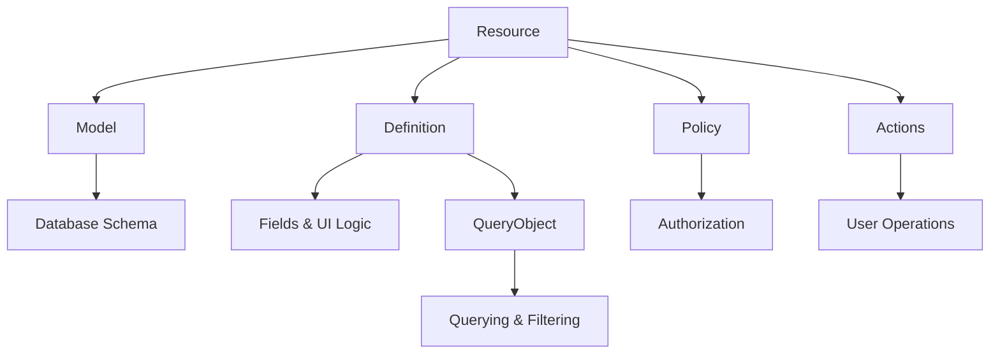

# Core Concepts

::: tip What you'll learn
- Plutonium's architecture and how its core components work together
- The role of Resources as your application's building blocks
- How Packages help organize and modularize your code
- Entity Scoping for building multi-tenant applications
- Best practices for maintainable, scalable applications
:::

## Understanding Resources

Think of Resources as the DNA of your Plutonium application. Every meaningful piece of data or functionality in your app—whether it's a User, Product, or Blog Post—is represented as a Resource. But unlike traditional Rails models, Plutonium Resources are rich, self-contained units that know how to display themselves, authorize access, and handle user interactions.

### The Anatomy of a Resource

Each Resource is composed of four key components that work together seamlessly:



- **Model**: Your familiar Active Record model with validations, associations, and business logic
- **Definition**: Describes how the Resource appears and behaves in the UI
- **Policy**: Controls who can access what and when
- **Actions**: Custom operations users can perform on the Resource

::: details Complete Resource Example

Let's see how all these pieces fit together in a real User resource:

::: code-group
```ruby [Model]
# app/models/user.rb
class User < ApplicationRecord
  include Plutonium::Resource::Record

  # Standard Rails associations
  has_many :posts
  has_many :comments
  belongs_to :organization

  # Helpful scopes for filtering
  scope :active, -> { where(status: :active) }

  # Standard validations
  validates :name, presence: true
  validates :email, presence: true, uniqueness: true
  validates :role, presence: true, inclusion: {in: %w[admin user]}

  def admin? = role == "admin"
end
```

```ruby [Definition]
# app/definitions/user_definition.rb
class UserDefinition < Plutonium::Resource::Definition
  # How fields appear in forms and tables
  field :name, as: :string
  field :email, as: :email

  # Enable search functionality
  search do |scope, query|
    scope.where("name LIKE :q OR email LIKE :q", q: "%#{query}%")
  end

  # Add filters for easy data browsing
  filter :role, with: SelectFilter, choices: %w[admin user guest]
  filter :status, with: SelectFilter, choices: %w[active inactive]

  # Expose useful scopes
  scope :active

  scope :admins do
    where(role: :admin)
  end

  # Custom actions users can perform
  action :deactivate,
    interaction: DeactivateUser,
    color: :warning,
    icon: Phlex::TablerIcons::UserOff

  # Customize the detail page
  show_page_title "User Details"
  show_page_description "View and manage user information"
end
```

```ruby [Policy]
# app/policies/user_policy.rb
class UserPolicy < Plutonium::Resource::Policy
  # Basic CRUD permissions
  def read?
    true # Everyone can view users
  end

  def create?
    user.admin? # Only admins can create users
  end

  def update?
    user.admin? || record.id == user.id # Admins or self
  end

  def destroy?
    user.admin? && record.id != user.id # Admins, but not themselves
  end

  # Custom action permissions
  def deactivate?
    user.admin? && record.status == :active && record.id != user.id
  end

  # Control which fields are visible/editable
  def permitted_attributes_for_read
    if user.admin?
      %i[name email role status created_at updated_at]
    else
      %i[name email status]
    end
  end

  def permitted_attributes_for_create
    if user.admin?
      %i[name email role status password]
    else
      %i[name email password]
    end
  end

  def permitted_attributes_for_update
    if user.admin?
      %i[name email role]
    else
      %i[name email]
    end
  end

  # Control access to related resources
  def permitted_associations
    %i[posts comments]
  end
end
```

```ruby [Deactivate Interaction]
# app/interactions/user_interactions/deactivate.rb
module UserInteractions
  class Deactivate < Plutonium::Resource::Interaction
    # How this action appears in the UI
    presents label: "Deactivate User",
             icon: Phlex::TablerIcons::UserOff,
             description: "Deactivate user account"

    # What data this action needs
    attribute :resource, class: User
    attribute :reason, :string

    # Validation rules
    validates :resource, presence: true
    validates :reason, presence: true

    # The actual business logic
    def execute
      resource.transaction do
        resource.status = :inactive
        resource.deactivated_at = Time.current
        resource.deactivation_reason = reason

        if resource.save
          succeed(resource)
            .with_message("User was successfully deactivated")
            .with_redirect_response(resource)
        else
          failed(resource.errors)
        end
      end
    end
  end
end
```
:::

## Organizing with Packages

As your application grows, you need a way to organize your code that doesn't turn into a tangled mess. That's where Packages come in. Think of them as specialized containers that help you group related functionality and keep your application modular.

Plutonium uses two types of packages, each with a specific purpose:

### Feature Packages: Your Business Logic Containers

Feature packages are where your core business logic lives. They're self-contained modules that focus on a specific domain area of your application—like blogging, e-commerce, or user management.

::: tip What Makes a Good Feature Package
- **Domain-focused**: Centers around a specific business area
- **Self-contained**: Has everything it needs to function
- **No web interface**: Pure business logic, no controllers or views
- **Reusable**: Can be used across different parts of your app
:::

::: code-group
```ruby [Directory Structure]
packages/
└── blogging/
    ├── app/
    │   ├── models/
    │   │   └── blogging/
    │   │       ├── post.rb
    │   │       └── comment.rb
    │   ├── definitions/
    │   │   └── blogging/
    │   │       ├── post_definition.rb
    │   │       └── comment_definition.rb
    │   ├── policies/
    │   │   └── blogging/
    │   │       ├── post_policy.rb
    │   │       └── comment_policy.rb
    │   └── interactions/
    │       └── blogging/
    │           └── post_interactions/
    │               ├── publish.rb
    │               └── archive.rb
    ├── config/
    │   └── routes.rb
    └── lib/
        └── engine.rb
```

```ruby [Engine Configuration]
# packages/blogging/lib/engine.rb
module Blogging
  class Engine < ::Rails::Engine
    include Plutonium::Package::Engine
  end
end
```
:::

### Portal Packages: Your User Interface Gateways

Portal packages are the web-facing part of your application. They take the business logic from Feature packages and present it to users through a web interface. Each portal typically serves a specific audience—like administrators, customers, or partners.

::: tip What Makes a Good Portal Package
- **User-focused**: Designed for a specific type of user
- **Interface-heavy**: Controllers, views, and authentication
- **Feature composition**: Combines multiple feature packages
- **Access control**: Manages who can see and do what
:::

::: code-group
```ruby [Directory Structure]
packages/
└── admin_portal/
    ├── app/
    │   ├── controllers/
    │   │   └── admin_portal/
    │   │       ├── concerns/
    │   │       │   └── controller.rb
    │   │       ├── plutonium_controller.rb
    │   │       └── resource_controller.rb
    │   └── views/
    │       └── layouts/
    │           └── admin_portal.html.erb
    ├── config/
    │   └── routes.rb
    └── lib/
        └── engine.rb
```

```ruby [Engine Configuration]
# packages/admin_portal/lib/engine.rb
module AdminPortal
  class Engine < ::Rails::Engine
    include Plutonium::Portal::Engine

    # All resources in this portal are scoped to an organization
    scope_to_entity Organization, strategy: :path
  end
end
```

```ruby [Routes Configuration]
# packages/admin_portal/config/routes.rb
AdminPortal::Engine.routes.draw do
  root to: "dashboard#index"

  # Make resources from feature packages available in this portal
  register_resource Blogging::Post
  register_resource Blogging::Comment
end
```

```ruby [Controller Configuration]
# packages/admin_portal/app/controllers/admin_portal/concerns/controller.rb
module AdminPortal
  module Concerns
    module Controller
      extend ActiveSupport::Concern
      include Plutonium::Portal::Controller

      # Add authentication to this portal
      include Plutonium::Auth::Rodauth(:admin)
    end
  end
end
```
:::

## Entity Scoping: Building Multi-Tenant Applications

One of Plutonium's most powerful features is Entity Scoping—a clean way to build multi-tenant applications where data is automatically partitioned based on a parent entity like Organization, Account, or Team.

Here's the magic: when you properly set up entity scoping, Plutonium automatically ensures users only see and can access data that belongs to their organization. No manual filtering required!

### How It Works

```ruby
# 1. Configure scoping in your portal engine
module AdminPortal
  class Engine < ::Rails::Engine
    include Plutonium::Portal::Engine

    # Path-based scoping creates URLs like /org_123/posts
    scope_to_entity Organization, strategy: :path

    # Or use a custom strategy for more control
    scope_to_entity Organization, strategy: :current_organization
  end
end

# 2. Set up your models with proper associations
class Post < ApplicationRecord
  include Plutonium::Resource::Record

  # Direct relationship to the scoping entity
  belongs_to :user
  belongs_to :organization, through: :user

  # Alternative: custom scoping for complex relationships
  scope :associated_with_organization, ->(organization) do
    joins(:user).where(users: { organization_id: organization.id })
  end
end

# 3. Implement the scoping strategy in your controller
module AdminPortal::Concerns::Controller
  private

  # This method name must match your strategy name
  def current_organization
    # Extract tenant from subdomain, path, or any other source
    @current_organization ||= Organization.find_by!(subdomain: request.subdomain)
  end
end
```

### The Result

With this setup, when a user visits `/posts`, they automatically see only posts from their organization. When they create a new post, it's automatically associated with their organization. All of this happens transparently—no extra code needed in your controllers or views.

## Best Practices for Success

### Organizing Your Packages

::: tip Feature Packages
- **Keep domains separate**: Each package should focus on one business area
- **Minimize dependencies**: Packages should be as independent as possible
- **Clear interfaces**: Use well-defined APIs for package interactions
- **Single responsibility**: One clear purpose per package
:::

::: tip Portal Packages
- **User-centric design**: Each portal serves a specific user type
- **Consistent authentication**: Use the same auth strategy throughout a portal
- **Clear scoping rules**: Be explicit about data access boundaries
- **Compose, don't duplicate**: Reuse feature packages rather than rebuilding
:::

### Designing Robust Resources

::: tip Model Layer
- **Clear validations**: Make invalid states impossible
- **Meaningful associations**: Reflect real business relationships
- **Useful scopes**: Provide common query patterns
- **Business methods**: Encode domain logic in the model
:::

::: tip Definition Layer
- **Appropriate field types**: Match the UI to the data
- **Efficient search**: Index searchable fields properly
- **Logical grouping**: Organize fields and actions intuitively
- **Clear labeling**: Use human-friendly names and descriptions
:::

::: tip Policy Layer
- **Granular permissions**: Control access at the field level when needed
- **Explicit rules**: Make authorization logic clear and testable
- **Action-specific controls**: Different actions may need different rules
- **Association security**: Control access to related data
:::

### Security First

::: warning Critical Security Practices
- **Always implement policies**: Never rely on "security through obscurity"
- **Use entity scoping consistently**: Don't mix scoped and unscoped access
- **Validate all inputs**: Trust nothing from the user
- **Control associations**: Prevent unauthorized data access through relationships
- **Audit sensitive actions**: Log important operations for compliance
:::

## Generator Support

Plutonium provides generators to quickly scaffold components:

```bash
# Create a new feature package
rails generate pu:pkg:package blogging

# Create a new portal package
rails generate pu:pkg:portal admin

# Create a new resource
rails generate pu:res:scaffold post title:string content:text

# Connect a resource to a portal
rails generate pu:res:conn
```
